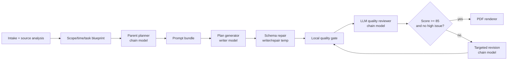

# Review Plan Workflow Audit and Architecture

## Workflow Audit

### Current Entry Points

- Frontend: `frontend/src/App.tsx` posts text and file payloads to `/api/review-plans`.
- Backend API: `app.py` creates a pending lesson and returns `202`.
- Worker: `app.py::_run_review_plan_generation_job` handles transcription, plan generation, PDF rendering, and final status.
- LLM client: `review_plan_workflow.llm.client.generate_review_plan_json()`.
- Prompt source: `review_plan_workflow/prompts/` registry plus subject packs, style config, and rubrics.
- Renderer: `review_plan_templates.single_lesson_pdf` adapts the plan into `review_plan_templates.generate_review_pdfs`.

### Current Generation Flow

1. The frontend collects subject, class, topic, lesson date, weak points, and text/file input.
2. `/api/review-plans` validates auth, class access, duplicate request identity, and credits.
3. The backend creates a pending lesson and starts a background worker.
4. The worker optionally transcribes audio, then calls `review_plan_workflow.service`.
5. The workflow runs deterministic intake/source/scope/time/task/prompt-bundle nodes.
6. The chain-level `parent_planner` LLM node diagnoses the source material and writes a compact teaching blueprint.
7. The workflow-native `plan_generator` writer node makes one structured JSON LLM call using the parent blueprint and performs one schema repair retry when needed.
8. The deterministic quality gate records schema/quality review, then the chain-level `quality_reviewer_llm` node performs a second rubric pass.
9. If quality fails, `revision` can run up to two targeted LLM revision attempts and re-score each result.
10. The PDF adapter maps the returned JSON into the ReportLab review-plan template.
11. The lesson row stores final `plan_json`, `pdf_path`, status, error fields, and run trace metadata.

### Single API / Workflow Assessment

The product entry is asynchronous. Generation now has persisted node outputs and trace metadata. The final student-facing plan is still produced by one primary writer node, but source diagnosis, blueprint design, schema repair, LLM quality review, and targeted revision are bounded workflow steps controlled by code.

### Controls And Remaining Gaps

- Schema validation: final plan and node context now have Pydantic boundaries; `plan_generator` performs one schema repair retry.
- Intermediate state: node outputs are now persisted in `review_plan_runs`; node replay is still pending.
- Retry and revision: task-level retry remains in the worker; schema repair and quality revision now happen inside the workflow.
- Quality gate: deterministic quality review and an LLM rubric review now exist; either can trigger up to two targeted LLM revision attempts.
- Trace: review-plan traceId, node logs, prompt version, style version, and schema version now exist.
- Eval: existing tests cover async API and PDF basics, but not subject quality fixtures.
- Style separation: PDF style values were hard-coded in the renderer.
- Subject separation: math, physics, and IELTS rules were not represented as repo-managed subject packs.

## Code Structure Audit

| File | Lines | Current Responsibilities | Risk | Recommendation |
|---|---:|---|---|---|
| `lesson_manager.py` | 12000+ | DB schema, accounts, classes, lessons, students, CLI | Too large to split safely in this pass | Add only focused review-plan run helpers now |
| `frontend/src/App.tsx` | 10000+ | Whole app UI and review-plan page | Too many UI responsibilities | Keep frontend as API caller only in this phase |
| `app.py` | 7000+ | Routes, workers, AI charge orchestration | Review-plan worker owns too much generation detail | Move plan generation orchestration into `review_plan_workflow.service` |
| `ai_processor.py` | 2400+ | AI clients, prompts, legacy plan generation, other AI features | Giant inline prompt and unrelated AI features remain coupled | Do not use it from the review-plan workflow path; keep only for historical direct callers until a later cleanup |
| `generate_review_pdfs.py` | 1600+ | PDF rendering and visual style | Style hard-coded in Python | Load unified style config with physics as master visual language |

## Framework Decision

### Current Need

- Fixed pipeline or open-ended agent: fixed pipeline.
- Persistent graph state: not needed in Phase 1.
- Human-in-the-loop: not needed now.
- Branch recovery: task recovery is enough; node checkpoint replay can wait.
- Dynamic tool use: not needed.
- Long-running state: not needed for single-lesson generation.

### Recommendation

Use the existing OpenAI-compatible SDK, Pydantic schemas, a lightweight workflow executor, prompt registry, subject packs, unified style config, deterministic quality gate, trace logging, and eval fixtures.

### Why Not LangChain / LangGraph in Phase 1

The review-plan flow has a known order and should be controlled by code. Code should decide schema validity, score thresholds, revision limits, and node order. LangGraph becomes appropriate only when the product needs teacher approvals at intermediate nodes, pause/resume, tool-heavy retrieval, complex branching, graph visualization, or node-level replay.

## New Architecture

`review_plan_workflow/` is the new boundary:

- `executor.py`: small node runner with logs and node outputs.
- `state.py`: traceId, versions, warnings, logs, and node outputs.
- `schemas.py`: Pydantic schemas for inputs, node outputs, quality review, and final plan.
- `service.py`: single-lesson workflow entry used by the Flask worker.
- `nodes/`: intake normalizer, subject router, source analyzer, scope planner, time allocator, task blueprint, parent planner, prompt bundle builder, native plan generator, deterministic and LLM quality reviewers, and revision node.
- `llm/`: prompt registry, renderer, JSON parsing, OpenAI-compatible chat client, and usage extraction.
- `prompts/subjects/`: common, math, physics, IELTS subject packs.
- `prompts/styles/review_plan_style.yaml`: one unified visual system using physics as the master style.
- `prompts/rubrics/`: quality and workload checks.
- `evals/fixtures/`: minimum subject regression cases.

## Model Configuration

Review-plan generation uses its own optional chat model override:

- `XR_REVIEW_PLAN_PROVIDER`: optional provider for review-plan generation only.
- `XR_REVIEW_PLAN_MODEL`: optional model for review-plan generation only.
- `XR_REVIEW_PLAN_WRITER_PROVIDER`: provider for the `plan_generator` content-writing node. Defaults to `deepseek`.
- `XR_REVIEW_PLAN_WRITER_MODEL`: model for the `plan_generator` content-writing node. Defaults to `deepseek-v4-pro` when the writer provider is DeepSeek.

If the chain-level values are unset, the workflow falls back to the existing general chat configuration (`XR_PROVIDER` and provider default model such as `XR_DEEPSEEK_MODEL`). The `plan_generator` node is intentionally routed separately so the plan-writing step can stay on DeepSeek V4 Pro even when the rest of the review-plan workflow uses another model. Other nodes, including `revision`, still use the chain-level provider/model.

Review-plan generation also has node-level temperature controls:

- `XR_REVIEW_PLAN_TEMPERATURE`: chain-level parent planner and targeted revision temperature. Default `0.25`.
- `XR_REVIEW_PLAN_WRITER_TEMPERATURE`: `plan_generator` writing temperature. Default `0.35`.
- `XR_REVIEW_PLAN_REPAIR_TEMPERATURE`: schema repair temperature. Default `0.1`.
- `XR_REVIEW_PLAN_REVIEWER_TEMPERATURE`: LLM quality reviewer temperature. Default `0.1`.

The intended production split is:

- Chain/parent/reviewer/revision model: `XR_REVIEW_PLAN_PROVIDER=openai`, `XR_REVIEW_PLAN_MODEL=gpt-5.4`, `XR_REVIEW_PLAN_REASONING_EFFORT=high`.
- Writing model: `XR_REVIEW_PLAN_WRITER_PROVIDER=deepseek`, `XR_REVIEW_PLAN_WRITER_MODEL=deepseek-v4-pro`.

This gives the workflow a Codex-like division of labor: a stronger parent model does diagnosis, task decomposition, risk finding, and revision direction, while the writer model focuses on producing the concrete student-facing plan.

## Prompt Layering

Final prompt composition must follow this order:

1. System role prompt.
2. Node task prompt.
3. Subject pack.
4. Relevant schema description.
5. Current workflow state.
6. Style config only in final rendering/PDF rendering.
7. Rubric only in quality/revision nodes.

Do not reassemble the teacher prompt files into one super prompt.

## Desktop Prompt Migration

The repo-managed prompt packs now absorb the previously external desktop workflow files from `/Users/xiaodi/Desktop/星润复习计划工作流`:

- `物理.md`: migrated into `prompts/subjects/physics.yaml`, `prompts/styles/review_plan_style.yaml`, `prompts/rubrics/review-plan-quality.yaml`, and shared rules in `prompts/nodes/task-generator.md`.
- `数学/崔老师.md` and `数学/华老师.md`: merged into `prompts/subjects/math.yaml` and shared rules in `prompts/nodes/task-generator.md`.
- `雅思.md`: migrated into `prompts/subjects/ielts.yaml`, focused on IELTS Reading strategy, matching/fill/true-false-not-given logic, and error-type review.
- `数学/崔老师.py`: kept as historical renderer/reference material. Reusable prompt rules were migrated, but executable renderer code is not imported into the workflow package.

New teacher-specific prompt material should be decomposed into system prompt, node prompt, subject pack, style config, rubric, or tests. Do not copy a full desktop prompt into one large system prompt.

## Trace and Debugging

Each generation run receives a `trace_id`. The `review_plan_runs` table stores:

- lesson and organization IDs
- status
- subject
- provider/model
- prompt/schema/style versions
- warnings
- quality review
- node outputs
- node logs

API responses may include `trace_id`, `workflow_warnings`, `quality_review`, `prompt_version`, and `style_version` without breaking older frontend consumers.

## Current Node Chain

The current single-lesson service executes this ordered chain:

1. `intake_normalizer`: normalize raw request fields and missing info.
2. `subject_router`: choose math, physics, IELTS, or common subject pack.
3. `source_analyzer`: extract confirmed topics, evidence, and source risks.
4. `scope_planner`: build review days, module sequence, review loop, warnings, and assumptions.
5. `time_allocator`: map the review scope to day-level workload and buffer strategy.
6. `task_blueprint`: produce subject-aware task blocks, required components, output contract, and risk controls.
7. `parent_planner`: uses the chain-level model to produce a teaching blueprint with diagnosis, knowledge map, day strategies, writer instructions, quality risks, and success criteria.
8. `prompt_bundle_builder`: render the next LLM prompt bundle and version it, including the parent blueprint.
9. `plan_generator`: calls the writer OpenAI-compatible JSON generator using the rendered prompt bundle and parent blueprint; performs one schema repair retry if the generated plan is invalid.
10. `quality_reviewer`: deterministic schema and quality gate.
11. `quality_reviewer_llm`: uses the chain-level model to review whether the generated plan follows the parent blueprint and avoids template-like low-quality output.
12. `revision`: if either reviewer fails the plan, revises it up to two times, re-running deterministic and LLM quality review after each attempt and returning the highest-scoring result with warnings if it still fails.



## Adding a New Subject

1. Add `prompts/subjects/<subject>.yaml`.
2. Add subject-specific checks to `prompts/rubrics/subject-specific-checks.yaml`.
3. Add at least one eval fixture.
4. Update the subject router mapping.
5. Add quality-gate checks only when they can be expressed deterministically.

## Running Evals

Phase 1 eval fixtures are JSON files under `review_plan_workflow/evals/fixtures/`. They are paired with `review_plan_workflow.evals.runner`, a deterministic local runner that validates fixture definitions and can score a generated plan against schema, quality-gate output, review-day structure, and keyword checks.

Run local fixture validation:

```bash
python3 -m review_plan_workflow.evals.runner --validate-fixtures-only
```

Run an opt-in workflow eval for one fixture:

```bash
python3 -m review_plan_workflow.evals.runner \
  --run-workflow \
  --fixture math/algebra-weakness-6-week.json \
  --output /tmp/review-plan-eval-report.json
```

`--run-workflow` uses the existing `review_plan_workflow.service.generate_single_lesson_review_plan()` path and may call the configured LLM provider. Normal unit tests should keep using fake generators; live evals are manual proof runs when API keys and cost are expected.

This is still not a full benchmark suite. It is a regression baseline for schema, subject fit, workload sanity, factuality, and the China-school-course default for math/physics fixtures.

## Known Limitations

- The old `ai_processor.py` single-lesson review-plan entrypoint and inline prompt have been removed from active code. Plan generation now lives in one workflow-native LLM node after structured intake/source/scope/time/task/prompt-bundle preparation.
- Quality revision is now bounded to two LLM attempts; the remaining quality work is running live fixture eval reports and real PDF smoke review.
- IELTS source material currently covers Reading best; full four-skill IELTS generation remains Phase 2.
